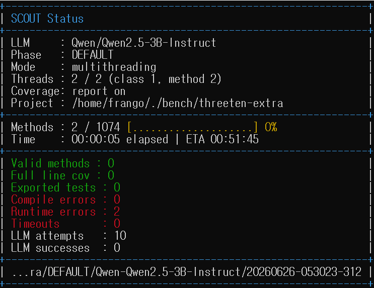

# SCOUT

**SCOUT** is an LLM-based unit test generator for Java. It walks a class method by method, asks a large language model to write JUnit tests, validates and repairs them through a generate–validate–fix loop, and exports only the tests that compile and pass. It measures coverage as it goes, so generation is steered toward the code that is still uncovered.

Highlights:

- **Coverage-guided generation** — SCOUT targets uncovered branches scenario by scenario.
- **Maven and Gradle** target projects, auto-detected — no build-tool plugin to install.
- **Built-in JaCoCo coverage**, run in-process (no `mvn`/`gradle` invocation during generation or measurement).
- A **live terminal status window** for long runs.
- **Resume support** — a crashed run can be restarted and skips methods it already attempted.
- **Resource limits and timeouts** for large, long-running experiments.



*Live terminal status window — phase, model, thread usage, method progress, and per-run counters. See [Status Window](#status-window) for what each field means.*

## Installation

SCOUT is a self-contained, runnable JAR built with Maven.

1. **Prerequisites:** a full **JDK 8 or later** — a JDK, not just a JRE, because SCOUT compiles and runs the generated tests in-process for coverage — and **Maven 3.x**.

2. **Build:**

   ```bash
   git clone <repository-url>
   cd SCOUT
   mvn clean package        # add -DskipTests to skip the test suite
   ```

   This produces the runnable JAR at `target/scout.jar`.

3. **Verify:**

   ```bash
   java -jar target/scout.jar --help
   ```

## Quick Start

Generate tests for a whole project:

```bash
java -jar target/scout.jar \
  --project /path/to/project \
  --phase SCOUT \
  --llm code-llama \
  --url http://localhost:8000/v1/chat/completions \
  --api-key NO_API \
  --output /tmp/scout-out
```

Generate tests for a single class — add `--class <fqcn>`:

```bash
java -jar target/scout.jar --project /path/to/project --class com.example.Target \
  --phase SCOUT --llm code-llama --url http://localhost:8000/v1/chat/completions --output /tmp/scout-out
```

Generated tests are written under `<output>/<model>/<yyyyMMdd-HHmmss-SSS>/`.

The API key can also come from the environment instead of `--api-key`: `export OPENAI_API_KEY=sk-...`. The CLI option takes precedence when both are set; use `NO_API` for local servers that need no key.

## Target Projects: Maven and Gradle

SCOUT auto-detects the target's build tool from the `--project` directory:

- `pom.xml` present → **Maven** (auto-compiled if needed).
- no `pom.xml`, but `build.gradle(.kts)` / `settings.gradle(.kts)` present → **Gradle**.
- neither → SCOUT stops with a clear error.

For **Gradle** projects, SCOUT does not invoke Gradle — build the project first and supply its dependency jars:

- **Compiled classes** are read from `build/classes/java/main`; run `./gradlew classes` beforehand.
- **Dependency jars** come from `--lib <dir>`, or, when omitted, from `<project>/target/dependency`.

```bash
./gradlew classes      # in the target project
java -jar target/scout.jar --project /path/to/gradle-project --lib /path/to/deps \
  --phase SCOUT --llm code-llama --url http://localhost:8000/v1/chat/completions --output /tmp/scout-out
```

Generation, validation, and coverage are identical to the Maven case.

## Options

| Option | Meaning |
| --- | --- |
| `--project <dir>` | Target project directory (Maven or Gradle; auto-detected). |
| `--pom <file>` / `--lib <dir>` | Use instead of `--project`: target POM and dependency-jar directory. `--lib` is also how Gradle targets supply dependencies. |
| `--class <fqcn>` | Single target class. If omitted, all parsed classes are targeted. |
| `--phase <phase>` | Generation phase. Default focus is `SCOUT` (see [Phases](#phases)). |
| `--output <dir>` | Base output directory. |
| `--resume <run-dir>` | Resume a previous run, skipping methods already attempted. See [Resuming an Interrupted Run](#resuming-an-interrupted-run). |
| `--llm <model>` / `--url <url>` | Model name and the OpenAI-compatible chat-completion endpoint. |
| `--api-key <key>` | API key. Falls back to `OPENAI_API_KEY` if omitted; `NO_API` for keyless local servers. |
| `--multithread true\|false` / `--maxthreads <n>` | Multithreaded method execution and its upper bound (default: CPU count − 2). |
| `--rounds <n>` | Maximum repair rounds. Default 5. |
| `--report-coverage true\|false` | Report final coverage after generation. Default true. |
| `--coverage-tests <dir>` | Measure coverage for an existing generated-test directory; skips generation. |
| `--merge true\|false` | Also export merged suite classes under `test_merged/`. Default false. |
| `--resource-profile true\|false` | Enable resource limiters/timing profiler, plus `--llm_threads` / `--compile_threads` / `--run_threads` / `--coverage_threads`. Default false. |

Most options accept both dash and underscore forms (e.g. `--report-coverage` / `--report_coverage`).

## Resuming an Interrupted Run

Long runs can die mid-way (a crash, an OOM, a manual stop). Every run records what it attempts, so a deliberate re-run picks up where it left off.

- During *every* run, each method is logged the moment generation starts, as a marker file under `<run-output>/method-progress/` (one JSON file per method: key, phase, timestamps, `started` → `ok`/`error`). Always-on so a first crash is recoverable; overhead is negligible local I/O.
- Re-run with `--resume <previous-run-dir>` (the `<output>/<model>/<timestamp>` folder). SCOUT reuses that exact directory, reads the markers, and **skips any method that was already started** — generating only untouched methods. The status window `Mode` line shows `(resume)`.

```bash
java -jar target/scout.jar --project /path/to/project --phase SCOUT \
  --llm code-llama --url http://localhost:8000/v1/chat/completions \
  --resume /tmp/scout-out/<model>/<yyyyMMdd-HHmmss-SSS>
```

## Coverage

Final coverage is reported by default (and is the whole job in `--coverage-tests` mode). SCOUT runs JaCoCo in-process and writes, in the run directory:

```text
coverage-summary.json / .txt    experiment-summary.txt
fully_covered_methods.json      coverage-invalid-tests.json / .txt
```

The CLI also prints a concise summary (instruction/branch/line coverage, valid/failed test counts, fully-covered method count). `fully_covered_methods.json` lists methods that reached 100% line coverage.

**Export policy:** after the first successful test for a method, SCOUT exports later passing tests only when they cover a previously uncovered branch or region — keeping the output free of redundant tests.

## Status Window

Normal runs suppress noisy logs and render a compact status window that repaints in place. Generation mode shows the phase/step, target project, model, output directory, execution mode (`single-thread` / `multithreading`, with `(resume)` when resuming), thread usage, method progress, and counters (valid methods, exported tests, fully-covered methods, compile/runtime/timeout errors, LLM attempts/successes). Coverage-only mode shows a coverage-focused view (valid tests, compile/runtime errors, coverage progress).

## Phases

SCOUT's focus is the `SCOUT` phase — coverage-guided, scenario-driven generation. Other phases, inherited from ChatUniTest, are also available via `--phase`: `DEFAULT`, `COVERUP`, `CHATTESTER`, `HITS`, `TELPA`, `SYMPROMPT`, `TESTPILOT`, `MUTAP`.

## Reference and Attribution

SCOUT is **derived from ChatUniTest Core**, the LLM-based Java unit test generation framework by ZJU-ACES-ISE.

- Upstream project: **ChatUniTest** (ZJU-ACES-ISE) — https://github.com/ZJU-ACES-ISE
- Upstream Maven coordinates: `io.github.zju-aces-ise:chatunitest-core` (SCOUT keeps these coordinates; only the build output is renamed to `scout`).

The upstream generate–validate–fix architecture, prompt template system, project parsing, validation pipeline, and the non-SCOUT phases are preserved here. SCOUT adds coverage-guided scenario generation, in-process coverage reporting, the terminal status window, resume support, Gradle target support, and stability controls for large runs. All credit for the original framework belongs to the ChatUniTest authors.


## Contact

If you have any questions, feedback, or would like to use SCOUT in your research, please contact the authors:

- frango.lee@samsung.com


